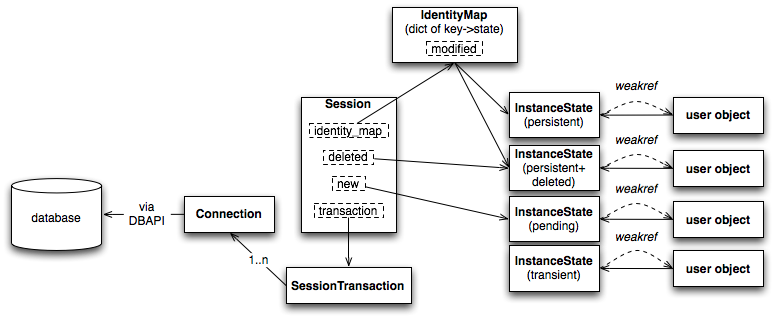

# SQLAlchemy

**SQLAlchemy的ORM架构**

这样的架构的好处是带来了 Core 与 ORM 的解耦和，当我们需要高性能的 SQL 执行但又不想抛弃 SQLAlchemy 带来的session管理、连接池管理、数据库“中立”的语句编写等这些好处时我们可以直接用 CORE。

Schema、SQL Expression Language ，可以写Raw sql，也可以写SQL EXxpression.

**DBAPI**

SQLAlchemy并没有提供直接连接数据库的功能，而是通过第三方实现(Third party libraries)，具体可以在 SQAlchemy 的dialects页面里查到

**Engine**

Engine是核心，因为Connection、 ResultProxy这些都是在Engine之后生成的，建立Engine则有两个重点，就是Pool和Dialect，前者是做连接池管理，后者则负 责与 DBAPI 的沟通

**Dialect**

通过Dialect和ExecutionContext向开发者提供了一致的接 口，前者处理了数据库的特性，比如使用 PostgreSQL 数据库其 Array 数据类型、schema、catalog等，后者处理psycopg2 DBAPI 的用法，比如 unicode 字符处理、服务端 cursor 的行为这些。

所以说，DBAPI中的cursor在 SQLAlchemy 中会被包装成ExecutionContext和ResultProxy来使用的。

**Schema**

我们需要首先定义在数据库中的表和字段的定义，及他们之间的关系， 也就是 Schema。对于数据库的使用来说，最基本的至少要有两个元素，那就是Table和Column，SQLAlchemy 使用了这两个名字来描述表和字段。多个Column组合成Table，然后一些 Table构成MetaData。Schema的结构设计主要来自于 Martin Fowler 撰写的 Patterns of Enterprise Application Architecture。

**Table And Columns**

Table和Column同时继承自sqlalchemy.schema 和sqlalchemy.sql，使用时既可以在 ORM 的方式中使用，也可以以 SQL Expression Language 使用。

`Table`从`sqlalchemy.sql.FromClause`的类继承,可以
"select from"

`Coloumn`从`sqlalchemy.sql.ColumnElement `的类继承，用在 SQL expression”。

**表达式树(ClauseElement)**

SQLAlchemy 可以生成结构丰富的各种语句，这是一个词法分析树，核心结构是ClauseElement。

在 Python 中，得益于其 Magic Method，我们可以用`__eq__`、`__ne__`、`__le__`、`__lt__`、`__add__`、`__mul__`方便的重载运算符。以 Column 为对象的运算符由一个 mixin 类ColumnOperators实现重载。

**编译**

在这里，编译指生成 SQL 语句，主要由Compiled类完成，这个类有两个核心的子类，`SQLComplier`和`DDLCompiler`。`SQLComplier`负责像`SELECT`、`INSERT`、`UPDATE`、`DELETE`这些统称为DQL (data query language) 和 DML (data manipulation language)的操作符的渲染，DDLCompiler负责CREATE和DROP，一般称为 DDL。此外，还有一个类TypeCompiler处理某些数据库的特殊语法。

Compiled的子类定以了一系列的 visit 开头的方法，每一个都源于一个ClauseElement的特定子类。然后Compiled对象维护名字、结合参数和子查询，最终是为了生成一个 SQL 查询语句。

**Map**

**Query and Loading Behavior**

**Seesion**

**Migration**

我们希望能像管理代码一样管理数据库，可以像 git 一样给数据库定义版本、升/降级、打标签，可以么？答案就是 Alembic。

